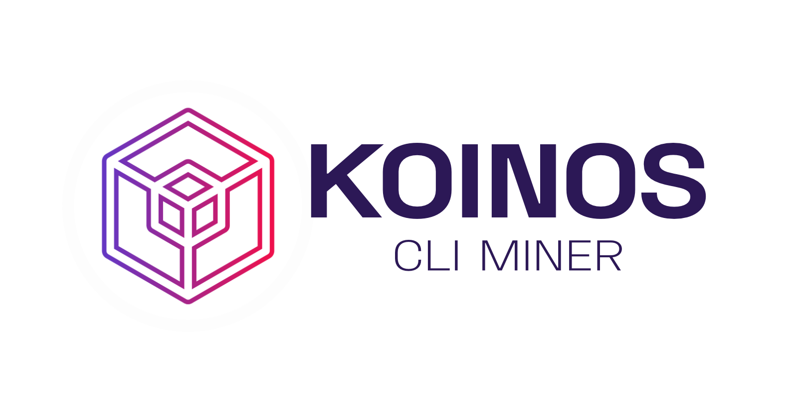

[](https://github.com/open-orchard/koinos-miner/issues)
[](https://github.com/open-orchard/koinos-miner/blob/master/LICENSE.md)

## Table of Contents
  - [Dependencies](#dependencies)
  - [Installation](#installation)
  - [Getting Started](#getting-started)
  - [Key Management](#key-management)
  - [Example Run](#example-run)

## Dependencies

Prior to installation, you'll need to install the necessary dependencies.

### Linux (Debian based)

```
sudo apt-get install git cmake build-essential libssl-dev
```

### macOS

On macOS, installing `gcc` is required to support OpenMP parallelization. Using the `brew` package manager, install OpenSSL and gcc.
```
brew install openssl gcc cmake
```

### Windows

On Windows, ensure that you are using the `MingW` compiler and you have installed `CMake`. Using the cholocately package manager, install OpenSSL.

```
choco install openssl
```

## Installation

For both Windows and Linux, you should be able to simply invoke the standard `npm` installer.

```
npm install
```

For macOS, you will need to specify the C compiler as `gcc`.

```
CC=gcc-10 npm install
```

For macOS, you also might need to set the correct openssl directory:

```
#1: Find your local ssl path (example: /usr/local/Cellar/openssl@1.1 or /usr/local/Cellar/openssl)
#2: Open package.json, change "postinstall" to "postinstall:other" and "postinstall:osx" to "postinstall"
#3: Look at "postinstall" and change the ssl paths for "DOPENSSL_ROOT_DIR" and "DOPENSSL_LIBRARIES". The second path is the same as the first just with "/lib" at the end
```

## Getting started

You can view the CLI miner arguments by using `npm` like so:

```
npm start -- --help
```

And get the following output:

```
❯ npm start -- --help

> koinos-miner@1.0.0 start /path/to/koinos-miner
> node app.js "--help"

Usage: app [OPTIONS]...

Options:
  -v, --version                      output the version number
  -a, --addr <addr>                  An ethereum address
  -e, --endpoint <endpoint>          An ethereum endpoint (default: "wss://ropsten-rpc.linkpool.io/ws")
  -t, --tip <percent>                The percentage of mined coins to tip the developers (default: "5")
  -p, --proof-period <seconds>       How often you want to submit a proof on average (default: "86400")
  -k, --key-file <file>              AES encrypted file containing private key
  -m, --gas-multiplier <multiplier>  The multiplier to apply to the recommended gas price (default: "1")
  -l, --gas-price-limit <limit>      The maximum amount of gas to be spent on a proof submission (default: "1000000000000")
  -l, --gwei-limit <limit>           The maximum amount of gas in gwei unit to be spent on a proof submission (default: "1000")
  -l, --gwei-minimum <minimum>       The minimum amount of gas in gwei unit to be spent on a proof submission (default: "25")
  -s, --speed <speed>                How fast should the transaction be: slow | medium | fast | fastest (default: "medium")
                                     (https://fees.upvest.co/estimate_eth_fees)`
  --import                           Import a private key
  --use-env                          Use private key from .env file (privateKey=YOUR_PRIVATE_KEY)
  --export                           Export a private key
  -h, --help                         display help for command
```

**Recipient Address**: The `--addr` argument specifies the recipient address, this is where KOIN will be rewarded.

**Ethereum Endpoint**: The `--endpoint` argument specifies the Ethereum node to be used when querying contract information and submitting proofs.

**Developer Tip**: The `--tip` argument specifies the percentage of rewarded KOIN to donate to the development team, thank you!

**Proof Period**: The `--proof-period` argument specifies the number of seconds on average the miner will attempt to mine and submit proofs.

**Gas Multiplier**: The `--gas-multiplier` argument specifies a multiplier to apply to the calculated gas price. This can be used to get your proofs submitted when the Ethereum network gas fees are spiking or are unpredictable.

**Gas Price Limit**: The `--gas-price-limit` argument specifies a cap in the acceptable gas price for a proof submission.

**Gwei Limit**: The `--gwei-limit` argument specifies a cap in the acceptable gas price (in gwei unit) for a proof submission.

**Gwei Minimum**: The `--gwei-minimum` argument specifies the minimum amount of gas (in gwei unit) to be paid for a proof submission.

Info: `--gwei-limit` and `--gwei-minimum` were added later to make it easier, as gwei prices are simpler to read. To provide backwards compatability, `--gas-price-limit` is still supported and will be used if `--gwei-limit` is not set. However, `--gas-price-limit` is recommended.

1 Gwei = 1000000000 Gas (https://eth-converter.com/)

A more detailed explanation of the different miner configurations can be found in the [Koinos GUI Miner](https://github.com/open-orchard/koinos-gui-miner) `README.md`.

## Key Management

The CLI miner provides the arguments `--import`, `--export`, and `--key-file`. These are used in handling the private key of the funding address. The user may import a private key and optionally store it in a key file in which case exporting the key is now possible.

If you know what you're doing, you can also use `--use-env` to get the key from an `.env` file:

```
echo privateKey=YOUR_PRIVATE_KEY | tee .env
```

## Example Run

A simple example of running the miner:

```
❯ npm start -- --endpoint http://167.172.118.40:8545 --addr 0x98047645bf61644caa0c24daabd118cc1d640f62 --import

> koinos-miner@1.0.0 start /path/to/koinos-miner
> node app.js "--endpoint" "http://167.172.118.40:8545" "--addr" "0x98047645bf61644caa0c24daabd118cc1d640f62" "--import"

 _  __     _                   __  __ _
| |/ /    (_)                 |  \/  (_)
| ' / ___  _ _ __   ___  ___  | \  / |_ _ __   ___ _ __
|  < / _ \| | '_ \ / _ \/ __| | |\/| | | '_ \ / _ \ '__|
| . \ (_) | | | | | (_) \__ \ | |  | | | | | |  __/ |
|_|\_\___/|_|_| |_|\___/|___/ |_|  |_|_|_| |_|\___|_|

[JS](app.js) Mining with the following arguments:
[JS](app.js) Ethereum Address: 0x98047645bf61644caa0c24daabd118cc1d640f62
[JS](app.js) Ethereum Endpoint: http://167.172.118.40:8545
[JS](app.js) Developer Tip: 5%
[JS](app.js) Proof Period: 86400

Enter private key:
Reinput a same one to confirm it:
Do you want to store your private key encrypted on disk? [y/n]: n
Imported Ethereum address: 0x98047645BF61644CAA0c24dAABD118cC1D640F62
[JS] Starting miner
```

## License

Copyright 2020 Open Orchard, Inc.

Koinos Miner is free software: you can redistribute it and/or modify
it under the terms of the GNU General Public License as published by
the Free Software Foundation, either version 3 of the License, or
(at your option) any later version.

Koinos Miner is distributed in the hope that it will be useful,
but WITHOUT ANY WARRANTY; without even the implied warranty of
MERCHANTABILITY or FITNESS FOR A PARTICULAR PURPOSE.  See the
GNU General Public License for more details.

You should have received a copy of the GNU General Public License
along with Koinos Miner.  If not, see <https://www.gnu.org/licenses/>.
